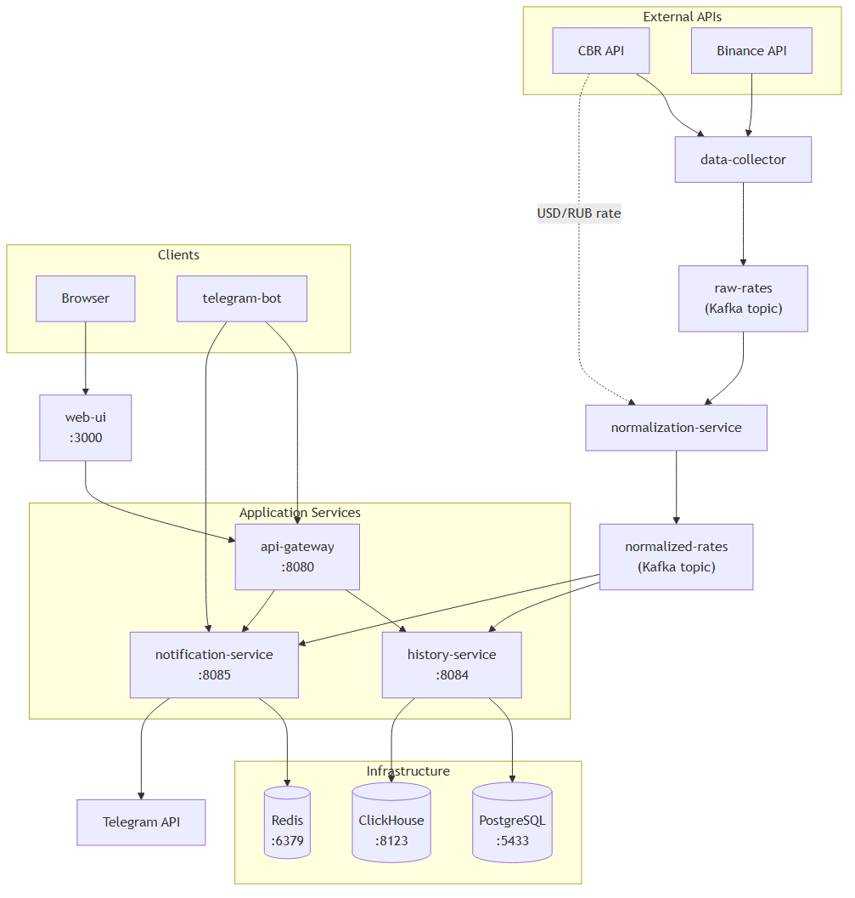

# Currency Tracker — Microservices Architecture

An event-driven distributed system for tracking fiat currency rates from the Central Bank of Russia (CBR) and cryptocurrency rates from Binance, built with Kafka as the messaging backbone and comprising 7 independent Go services.

## Directory Structure

```
microservices/
├── api-gateway/               # API Gateway — reverse proxy to backend services
│   ├── cmd/main.go
│   ├── internal/
│   │   ├── config/config.go
│   │   └── gateway/
│   │       ├── gateway.go         # Chi router, CORS, proxy handlers
│   │       ├── gateway_test.go    # Unit tests
│   │       └── integration_test.go
│   ├── Dockerfile
│   └── go.mod
├── data-collector/             # Polls CBR + Binance APIs, publishes to Kafka
│   ├── cmd/main.go
│   ├── internal/
│   │   ├── collector/
│   │   │   ├── cbr.go            # CBR daily JSON fetcher
│   │   │   ├── cbr_test.go
│   │   │   └── crypto.go         # Binance 24hr ticker fetcher
│   │   └── producer/
│   │       └── producer.go       # Kafka writer wrapper
│   ├── Dockerfile
│   └── go.mod
├── normalization-service/      # Consumes raw rates, normalizes, publishes
│   ├── cmd/main.go
│   ├── internal/
│   │   └── normalizer/
│   │       ├── normalizer.go     # Raw → normalized transformation (crypto/USDT × USD/RUB)
│   │       └── normalizer_test.go
│   ├── Dockerfile
│   └── go.mod
├── history-service/            # Persists rates, serves HTTP history API
│   ├── cmd/main.go
│   ├── internal/
│   │   ├── config/config.go
│   │   ├── handler/
│   │   │   ├── handler.go        # HTTP endpoints for CBR + crypto history
│   │   │   ├── cbr_fill.go       # Auto-backfill missing CBR days from archive
│   │   │   ├── crypto_fill.go    # Auto-backfill crypto from Binance klines
│   │   │   ├── handler_test.go
│   │   │   ├── crypto_fill_test.go
│   │   │   └── integration_test.go
│   │   ├── storage/
│   │   │   ├── postgres.go       # CBR rates → PostgreSQL
│   │   │   ├── clickhouse.go     # Crypto rates → ClickHouse
│   │   │   ├── types.go          # CurrencyRate, CryptoRate types
│   │   │   └── types_test.go
│   │   ├── subscriber/
│   │   │   └── subscriber.go     # Kafka consumer → storage dispatch
│   │   ├── cbrbackfill/
│   │   │   ├── fetch.go          # CBR archive downloader with fallback
│   │   │   └── fetch_test.go
│   │   └── cryptobackfill/
│   │       ├── client.go         # Binance kline fetcher with RUB conversion
│   │       ├── client_test.go
│   │       ├── interval.go       # Span → kline interval mapping
│   │       ├── interval_test.go
│   │       └── prefetch.go       # Parallel CBR USD/RUB prefetch
│   ├── Dockerfile
│   └── go.mod
├── notification-service/       # Manages subscriptions, pushes Telegram alerts
│   ├── cmd/main.go
│   ├── internal/
│   │   ├── config/config.go
│   │   ├── handler/
│   │   │   ├── handler.go        # Subscription CRUD HTTP endpoints
│   │   │   └── handler_test.go
│   │   ├── store/
│   │   │   ├── redis.go          # Redis-based subscription store
│   │   │   └── redis_test.go
│   │   └── subscriber/
│   │       └── subscriber.go     # Kafka consumer → Telegram notifications
│   ├── Dockerfile
│   └── go.mod
├── telegram-bot/               # Telegram bot user interface
│   ├── cmd/main.go
│   ├── internal/
│   │   ├── config/config.go
│   │   └── bot/
│   │       └── bot.go            # Command handlers, long polling
│   ├── Dockerfile
│   └── go.mod
├── shared/                     # Shared Kafka event contracts
│   ├── events/
│   │   └── events.go            # Topic names, event types (raw + normalized)
│   └── go.mod
├── web-ui/                     # Static web interface (standalone module)
│   ├── cmd/main.go              # Static file server
│   ├── static/
│   │   ├── index.html
│   │   ├── css/style.css
│   │   └── js/app.js
│   ├── Dockerfile
│   └── go.mod
├── tests/                      # End-to-end and load tests
│   ├── e2e/e2e_test.go          # Full workflow tests with mock services
│   ├── load/load_test.go        # Go benchmarks for throughput
│   └── go.mod
├── configs/
│   ├── .env.example
│   └── .env
├── docker-compose.yml          # 13 services (7 app + 5 infra + kafka-init)
└── go.work                     # Go workspace linking 8 modules
```

## Services

### Application Services

| Service | Port | Description |
|---------|------|-------------|
| **data-collector** | — | Polls CBR (daily) and Binance (every 60s), publishes raw JSON to `raw-rates` Kafka topic |
| **normalization-service** | — | Consumes `raw-rates`, normalizes data (date parsing, crypto×USD/RUB conversion), publishes to `normalized-rates` |
| **history-service** | 8084 | Consumes `normalized-rates`, persists CBR rates to PostgreSQL and crypto rates to ClickHouse. Serves HTTP API for historical queries with on-demand backfill |
| **notification-service** | 8085 | Manages user subscriptions in Redis, consumes `normalized-rates`, pushes Telegram notifications for crypto price changes |
| **api-gateway** | 8080 | Single entry point — reverse-proxies requests to history-service and notification-service with CORS |
| **telegram-bot** | — | Telegram bot (long polling) — handles commands, proxies subscription operations to notification-service |
| **web-ui** | 3000 | Static file server serving the Bootstrap 5 + Chart.js SPA |

### Infrastructure Services

| Service | Image | Port | Purpose |
|---------|-------|------|---------|
| PostgreSQL | `postgres:15-alpine` | 5433 | CBR fiat rate storage |
| ClickHouse | `clickhouse/clickhouse-server:24-alpine` | 8123, 9000 | Crypto rate time-series storage |
| Redis | `redis:7-alpine` | 6379 | Subscription state |
| Zookeeper | `cp-zookeeper:7.5.0` | 2181 | Kafka coordination |
| Kafka | `cp-kafka:7.5.0` | 9092 | Messaging backbone |

## Architecture



### Kafka Topics

| Topic | Partitions | Producer | Consumer |
|-------|-----------|----------|----------|
| `raw-rates` | 3 | data-collector | normalization-service |
| `normalized-rates` | 3 | normalization-service | history-service, notification-service |

## API Endpoints

### API Gateway (`:8080`)

#### General

| Method | Path | Description |
|--------|------|-------------|
| GET | `/ping` | Health check |

#### CBR Rates (proxied to history-service)

| Method | Path | Description |
|--------|------|-------------|
| GET | `/rates/cbr` | Rates by date (`?date=YYYY-MM-DD`) |
| GET | `/rates/cbr/range` | Rate range (`?code=USD&from=&to=`) |

#### Cryptocurrency Rates (proxied to history-service)

| Method | Path | Description |
|--------|------|-------------|
| GET | `/rates/crypto/symbols` | Available symbols |
| GET | `/rates/crypto/history` | History by symbol (`?symbol=BTCUSDT&limit=100`) |
| GET | `/rates/crypto/history/range` | History range (`?symbol=BTCUSDT&from=&to=`) |

#### Subscriptions (proxied to notification-service)

| Method | Path | Description |
|--------|------|-------------|
| POST | `/subscriptions/cbr` | Subscribe to fiat currency |
| DELETE | `/subscriptions/cbr` | Unsubscribe |
| GET | `/subscriptions/cbr` | List subscriptions (`?telegram_id=`) |
| POST | `/subscriptions/crypto` | Subscribe to crypto |
| DELETE | `/subscriptions/crypto` | Unsubscribe |
| GET | `/subscriptions/crypto` | List subscriptions (`?telegram_id=`) |

## Deployment

### Prerequisites

- Docker and Docker Compose
- A Telegram Bot Token (from [@BotFather](https://t.me/BotFather))

### Docker Compose (recommended)

```bash
cd microservices

# Configure
cp configs/.env.example configs/.env
# Edit configs/.env and set TELEGRAM_BOT_TOKEN

# Start all services (7 app + 5 infra + kafka-init)
docker-compose up --build

# Detached mode
docker-compose up -d --build

# Stop
docker-compose down

# Stop and remove volumes
docker-compose down -v
```

This starts 13 containers:
- 5 infrastructure: PostgreSQL, ClickHouse, Redis, Zookeeper, Kafka
- 1 init: Kafka topic creation (`raw-rates`, `normalized-rates` with 3 partitions each)
- 7 application: data-collector, normalization-service, history-service, notification-service, api-gateway, telegram-bot, web-ui

**Access points:**
- Web UI: `http://localhost:3000`
- API Gateway: `http://localhost:8080`

### Local Development (individual services)

```bash
cd microservices

# Start infrastructure only
docker-compose up -d postgres-history clickhouse redis kafka zookeeper

# Run a service (requires running infrastructure)
go run ./api-gateway/cmd/main.go
go run ./data-collector/cmd/main.go
go run ./history-service/cmd/main.go
go run ./normalization-service/cmd/main.go
go run ./notification-service/cmd/main.go
go run ./telegram-bot/cmd/main.go
go run ./web-ui/cmd/main.go
```

### Environment Variables

| Variable | Default | Description |
|----------|---------|-------------|
| `TELEGRAM_BOT_TOKEN` | — | Bot token (required) |
| `CBR_BASE_URL` | `https://www.cbr-xml-daily.ru` | CBR API base URL |
| `KAFKA_BROKERS` | `localhost:9092` | Kafka broker addresses |
| `REDIS_ADDR` | `localhost:6379` | Redis address |
| `HISTORY_DB_HOST` | `localhost` | PostgreSQL host |
| `HISTORY_DB_PORT` | `5433` | PostgreSQL port |
| `HISTORY_DB_USER` | `history_user` | PostgreSQL user |
| `HISTORY_DB_PASSWORD` | `history_password` | PostgreSQL password |
| `HISTORY_DB_NAME` | `history_db` | PostgreSQL database |
| `HISTORY_DB_SSLMODE` | `disable` | PostgreSQL SSL mode |
| `HISTORY_SERVICE_PORT` | `8084` | History service port |
| `NOTIFICATION_SERVICE_PORT` | `8085` | Notification service port |
| `API_GATEWAY_PORT` | `8080` | API gateway port |
| `COLLECT_INTERVAL_CBR` | `86400` | CBR polling interval (seconds) |
| `COLLECT_INTERVAL_CRYPTO` | `60` | Binance polling interval (seconds) |

## Go Workspace

The project uses a Go workspace (`go.work`) linking 8 modules:

```
api-gateway/      → go-chi/chi
data-collector/   → go-binance, kafka-go, shared
history-service   → clickhouse-go, chi, pq, kafka-go, shared
normalization-service → kafka-go, shared
notification-service → chi, go-redis, kafka-go, shared
telegram-bot      → telebot
shared            → (no external deps)
tests             → (no external deps)
```

`web-ui` is a standalone module outside the workspace (stdlib only).

## Testing

Test per workspace module (PowerShell-compatible syntax):

```bash
cd microservices

# All modules — unit + integration + e2e + load
go test ./api-gateway/... ./data-collector/... ./history-service/... `
        ./normalization-service/... ./notification-service/... `
        ./shared/... ./telegram-bot/... ./tests/...

# Skip integration/e2e (Docker-dependent) tests
go test -short ./api-gateway/... ./data-collector/... ./history-service/... `
        ./normalization-service/... ./notification-service/... `
        ./shared/... ./telegram-bot/... ./tests/...

# E2E tests only (build tag required)
go test -tags=e2e ./tests/...

# Load benchmarks
go test -bench=. ./tests/...

# Single service
go test ./api-gateway/...
go test -v ./history-service/internal/handler/
```

### Test Types

| Type | Location | Requires Docker |
|------|----------|----------------|
| Unit tests | Each service's `internal/` | No |
| Integration tests | `*_integration_test.go` files | Yes (TestContainers) |
| E2E tests | `tests/e2e/` | No (in-process mocks) |
| Load benchmarks | `tests/load/` | No (in-process mocks) |

## Telegram Bot Commands

| Command | Description |
|---------|-------------|
| `/start` | Welcome message |
| `/rates` | Current CBR rates for popular currencies |
| `/subscribe [code]` | Subscribe to currency updates |
| `/unsubscribe [code]` | Unsubscribe |
| `/crypto_subscribe [symbol]` | Subscribe to crypto updates |
| `/crypto_unsubscribe [symbol]` | Unsubscribe from crypto |
| `/history [currency]` | 7-day rate history |

## Tech Stack

| Component | Technology |
|-----------|-----------|
| Language | Go 1.23 |
| HTTP Router | Chi v5 |
| Message Broker | Apache Kafka (via segmentio/kafka-go) |
| Databases | PostgreSQL (fiat), ClickHouse (crypto) |
| Cache | Redis 7 |
| Crypto API | go-binance v2 |
| Telegram | tucnak/telebot |
| Containerization | Docker multi-stage builds, Docker Compose 3.8 |
| Testing | testify, TestContainers |

## License

MIT
