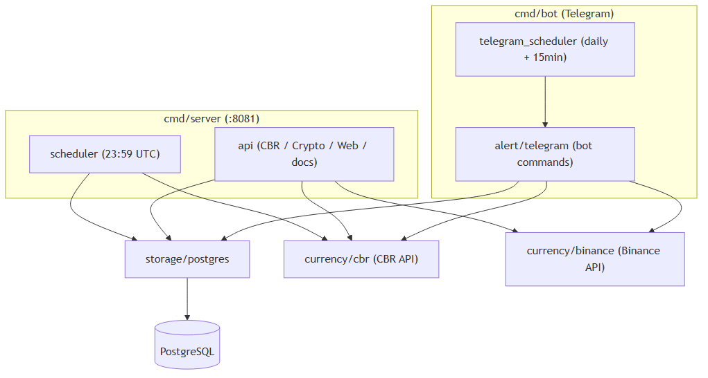

# Currency Tracker — Monolithic Architecture

A production-ready single-process Go application for tracking fiat currency rates from the Central Bank of Russia (CBR) and cryptocurrency rates from Binance, with a REST API, web interface, and Telegram bot.

## Directory Structure

```
monolith/
├── cmd/
│   ├── server/                # Web server entry point (HTTP API + static UI)
│   │   └── main.go
│   └── bot/                   # Telegram bot entry point
│       └── main.go
├── internal/
│   ├── api/                   # HTTP handlers and Chi router
│   │   ├── routes.go          # Route definitions and middleware
│   │   ├── base.go            # Shared handlers (ping, info, CORS)
│   │   ├── cbr_handlers.go    # CBR currency rate endpoints
│   │   ├── crypto_handlers.go # Cryptocurrency rate endpoints
│   │   ├── types.go           # Shared API types
│   │   └── handlers_test.go
│   ├── currency/
│   │   ├── cbr/               # CBR API client (XML/JSON rate fetching)
│   │   │   ├── cbr.go
│   │   │   └── cbr_test.go
│   │   └── binance/           # Binance API client (crypto/USDT + USD/RUB conversion)
│   │       ├── binance.go
│   │       └── binance_test.go
│   ├── storage/               # PostgreSQL data layer
│   │   ├── postgres.go
│   │   └── postgres_test.go
│   ├── scheduler/             # Background job scheduling
│   │   ├── scheduler.go       # Daily CBR rate fetch (server)
│   │   ├── telegram_scheduler.go  # Daily + 15-min crypto updates (bot)
│   │   └── scheduler_test.go
│   ├── alert/                 # Telegram bot implementation
│   │   ├── telegram.go
│   │   └── telegram_test.go
│   └── config/                # Configuration from environment
│       └── config.go
├── web/                       # Frontend assets (Bootstrap 5 + Chart.js SPA)
│   ├── index.html
│   ├── css/style.css
│   └── js/app.js
├── openapi/                   # OpenAPI 3.1.1 specification
│   └── openapi.json
├── configs/                   # Configuration templates
│   └── .env.example
├── docker-compose.yml         # PostgreSQL + Web Server + Bot
├── Dockerfile                 # Multi-stage build for web server
├── Dockerfile.bot             # Multi-stage build for Telegram bot
├── go.mod
└── go.sum
```

## Services

The monolith runs as **two independent processes** sharing a single PostgreSQL database:

### Web Server (`cmd/server`)

- **Port:** 8081
- **Framework:** Chi router
- **Responsibilities:**
  - REST API for CBR and crypto rates
  - Serves the web UI (static files)
  - Swagger UI at `/api/docs`
  - Scheduled daily CBR rate fetch at 23:59 UTC
  - On startup: initial rate fetch, schema migration

### Telegram Bot (`cmd/bot`)

- **Framework:** `tucnak/telebot` (long polling)
- **Responsibilities:**
  - Handles user commands for rates and subscriptions
  - Daily fiat + crypto updates to subscribers at 02:00 UTC
  - Crypto price change alerts every 15 minutes (notifications only for >= 2% change)
  - Persists subscriptions in PostgreSQL

## Architecture



## API Endpoints

### General

| Method | Path        | Description         |
| ------ | ----------- | ------------------- |
| GET    | `/`         | Web interface       |
| GET    | `/ping`     | Health check        |
| GET    | `/info`     | Service information |
| GET    | `/api/docs` | Swagger UI          |

### CBR Currency Rates

| Method | Path                             | Description                                              |
| ------ | -------------------------------- | -------------------------------------------------------- |
| GET    | `/rates/cbr`                     | All current rates (`?date=YYYY-MM-DD` for specific date) |
| GET    | `/rates/cbr/currency`            | Single currency (`?code=USD`, optional `&date=`)         |
| GET    | `/rates/cbr/history`             | Last N days (`?code=USD&days=30`)                        |
| GET    | `/rates/cbr/history/range`       | Date range (`?code=USD&start_date=&end_date=`)           |
| GET    | `/rates/cbr/history/range/excel` | Export to Excel                                          |

### Cryptocurrency Rates

| Method | Path                                | Description                                      |
| ------ | ----------------------------------- | ------------------------------------------------ |
| GET    | `/rates/crypto/symbols`             | Available crypto symbols                         |
| GET    | `/rates/crypto/history`             | Last N days (`?symbol=BTC&days=30`)              |
| GET    | `/rates/crypto/history/range`       | Date range (`?symbol=BTC&start_date=&end_date=`) |
| GET    | `/rates/crypto/history/range/excel` | Export to Excel                                  |

## Deployment

### Prerequisites

- Docker and Docker Compose
- A Telegram Bot Token (from [@BotFather](https://t.me/BotFather))

### Docker Compose (recommended)

```bash
cd monolith

# Configure
cp configs/.env.example .env
# Edit .env and set TELEGRAM_BOT_TOKEN

# Start all services (PostgreSQL + Web Server + Bot)
docker-compose up --build

# Detached mode
docker-compose up -d --build

# Stop
docker-compose down
```

This starts:

- PostgreSQL on port 5432
- Web server on port 8081
- Telegram bot (no exposed port)

### Local Development

```bash
cd monolith

# Install dependencies
go mod download

# Run web server (requires PostgreSQL)
go run ./cmd/server

# Run Telegram bot (requires PostgreSQL + TELEGRAM_BOT_TOKEN)
go run ./cmd/bot

# Build binaries
go build -o currency-tracker.exe ./cmd/server
go build -o currency-bot.exe ./cmd/bot
```

### Environment Variables

| Variable             | Default                        | Description                  |
| -------------------- | ------------------------------ | ---------------------------- |
| `DB_HOST`            | `localhost`                    | PostgreSQL host              |
| `DB_PORT`            | `5432`                         | PostgreSQL port              |
| `DB_USER`            | `currency_user`                | PostgreSQL user              |
| `DB_PASSWORD`        | `currency_password`            | PostgreSQL password          |
| `DB_NAME`            | `currency_db`                  | Database name                |
| `DB_SSLMODE`         | `disable`                      | SSL mode                     |
| `TELEGRAM_BOT_TOKEN` | —                              | Bot token (required for bot) |
| `CBR_BASE_URL`       | `https://www.cbr-xml-daily.ru` | CBR API base URL             |

## Database Schema

Four tables are created automatically on startup:

- **currency_rates** — CBR fiat rates (date, code, nominal, value, previous)
- **crypto_rates** — Binance crypto OHLCV data (timestamp, symbol, open, high, low, close, volume)
- **telegram_subscriptions** — User-to-fiat-currency subscriptions
- **telegram_crypto_subscriptions** — User-to-crypto subscriptions

## Telegram Bot Commands

| Command                        | Description                     |
| ------------------------------ | ------------------------------- |
| `/start`                       | Welcome message                 |
| `/currencies`                  | List available fiat currencies  |
| `/subscribe [code]`            | Subscribe to currency updates   |
| `/unsubscribe [code]`          | Unsubscribe from currency       |
| `/list`                        | Show your fiat subscriptions    |
| `/rate [code]`                 | Get current currency rate       |
| `/cryptocurrencies`            | List available cryptocurrencies |
| `/crypto_subscribe [symbol]`   | Subscribe to crypto updates     |
| `/crypto_unsubscribe [symbol]` | Unsubscribe from crypto         |
| `/crypto_list`                 | Show your crypto subscriptions  |
| `/crypto_rate [symbol]`        | Get current crypto/RUB rate     |

## Testing

```bash
cd monolith

# All tests
go test ./...

# Unit tests only (skips TestContainers integration)
go test -short ./...

# Verbose
go test -v ./...

# With coverage
go test -cover ./...

# Benchmarks
go test -bench=. ./...

# Specific test
go test -run TestFunctionName ./internal/api/
```

Integration tests in `internal/storage/` use [TestContainers](https://golang.testcontainers.org/) and require Docker.

## Tech Stack

| Component        | Technology                |
| ---------------- | ------------------------- |
| Language         | Go 1.23                   |
| HTTP Router      | Chi v5                    |
| Database         | PostgreSQL                |
| Crypto API       | go-binance v2             |
| Telegram         | tucnak/telebot            |
| Excel Export     | excelize v2               |
| Env Loading      | godotenv                  |
| Testing          | testify, TestContainers   |
| Containerization | Docker multi-stage builds |

## License

MIT
